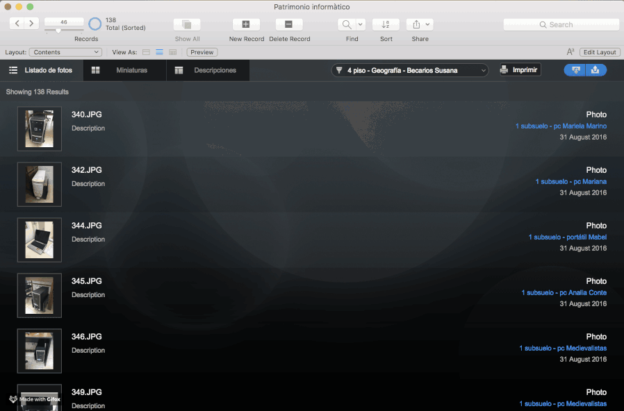
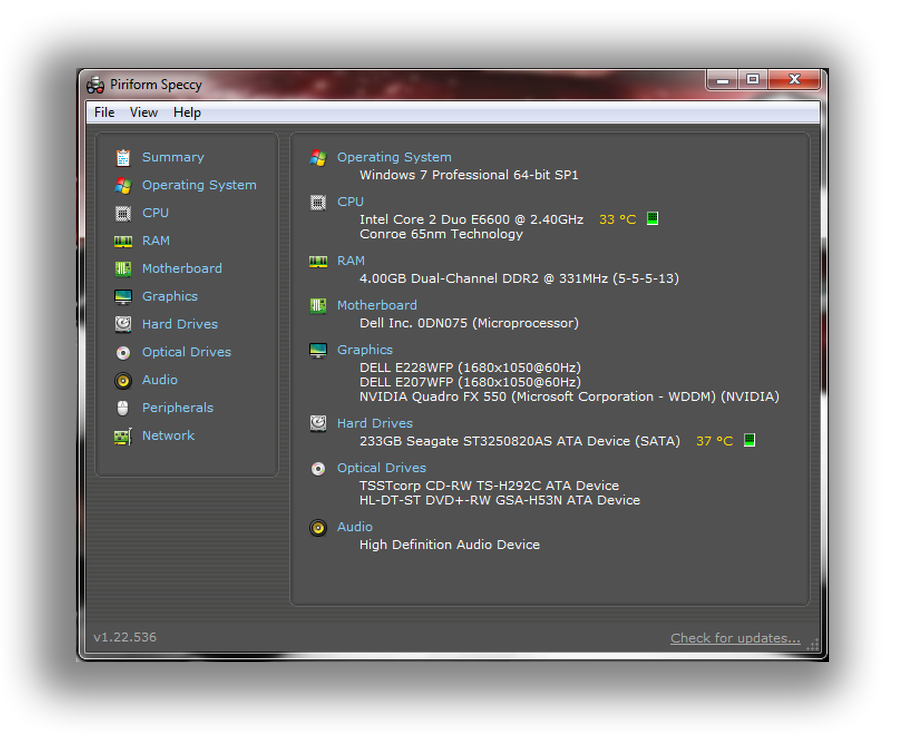
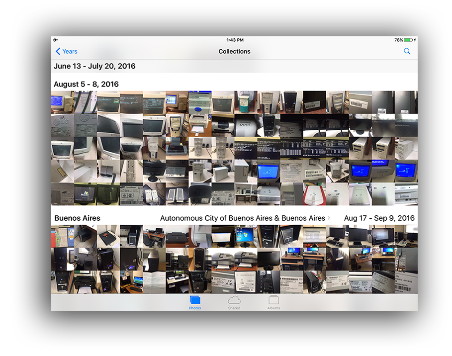

# Rationale #

* This document describes the software that brings a _custom_ solution: a visual database of all hardware assets that belongs to the institution
* It comes with an inner searcher that shows a visual representation of the object searched with all the linked metadata already gathered
* There are both tutorials for this solution-driven application: [español](tutorial_esp.md) and [english](tutorial.md) 
   

### What is this repository for? ###

* Quick summary
     - A custom, _in-house_ software solution to collect objects and search them visually. A _plus_: a spatial built-in searcher. 
 
* Version
     - 1.1 (final stage)
	

### How do I get set up? ###

* Summary of set up
     - [FileMaker v12](http://www.filemaker.com/es/products/) (or later)
	 - [FileMaker Go](https://itunes.apple.com/es/app/filemaker-go-16/id1097917885?mt=8): (mobile version for the ipad or iphone)
	 - Mac
          - Mac OSX Yosemite (or later)
     - PC
          - Microsoft Windows 7 (or later)
     - iOS devices
          - iPhone, iPad y iPod touch
          - iOS 10.2 (or later)
     - [Speccy](https://www.ccleaner.com/speccy): software to collect internal data about all the components inside a pc, ie: motherboard's model, graphic card capacity, size of hard drive, _et alia_.
     
	 - a camera device to capture all the devices. It can be a mobile or a pocket digital camera (preferred).
     

* Configuration
     - Download our [database](https://bitbucket.org/imhicihu/patrimonio-database/downloads/) from the `Downloads` folder
* Dependencies
     - No dependencies
* Database configuration
     - Since it is custom programmed, this _visual_ database fills our needs and deadlines.
* Deployment instructions
     - Download this [database](https://bitbucket.org/imhicihu/patrimonio-database/downloads/), browse it with your local installed Filemaker. You are set to get insights from your data collected.
     - A tutorial can be found [here](tutorial.md).

### Issues ###

* Check them on [here](https://bitbucket.org/imhicihu/patrimonio-database/issues) 

### Changelog ###

* Please check the [Commits](https://github.com/imhicihu/Patrimonio-database/commits/master) section for the current status

### Contribution guidelines ###

* Code review
     - This software is shared and can be _hacked_ with your custom needs. You can modify the order, the placement of graphics, the [GUI](https://en.wikipedia.org/wiki/Graphical_user_interface), _et alia_.
     - You need some knowledge of [ScriptMaker](https://community.filemaker.com/thread/164531#) to append or obliterate functions from this database.

### Who do I talk to? ###

* Repo owner or admin
     - Contact: `imhicihu` at `gmail` dot `com`

### Code of Conduct

* Please, check our [Code of Conduct](code_of_conduct.md)

### Legal ###

* All trademarks are the property of their respective owners.