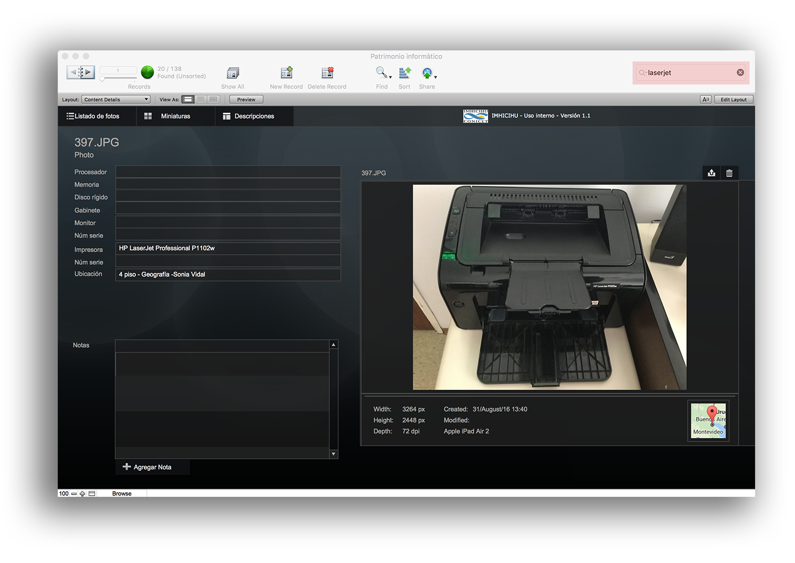
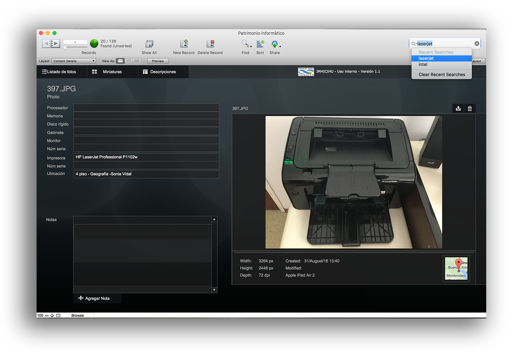
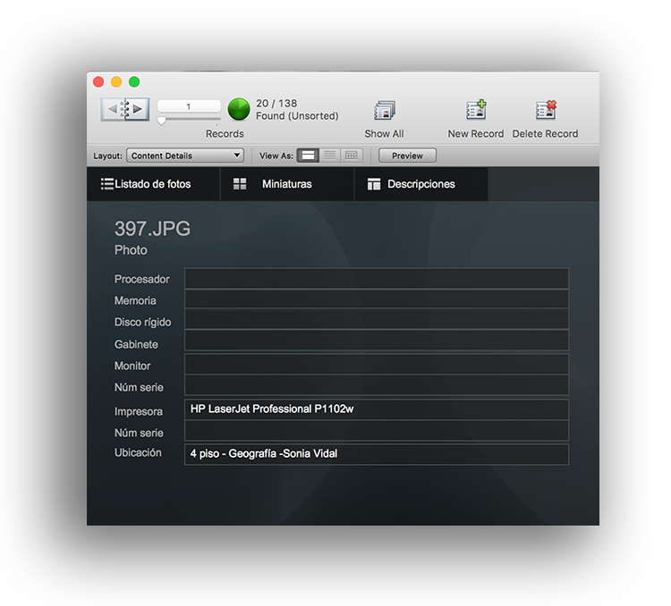
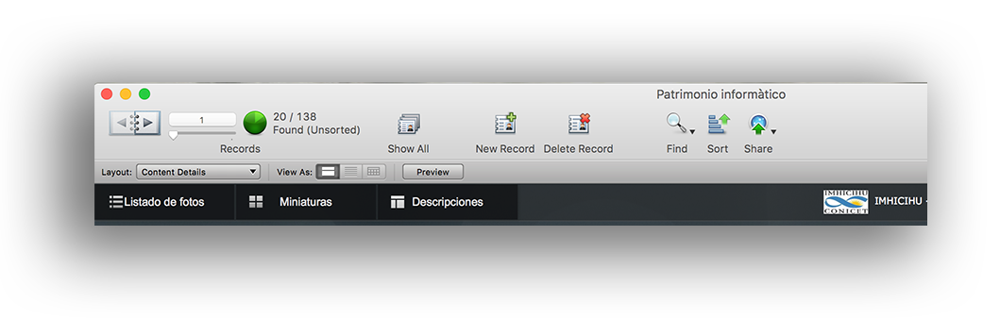

### Tutorial ###

* Magnifying glass (upper right section): searcher of all records gathered (numbers, words or photos associated with a certain record) 
 
* Click on the magnifying glass and it will display a pulldown menu: there will be all the last queries made

* In the upper left portion of the screen, it will show the records that meets the search pattern introduced in the built-in searcher. Click on both triangles to toggle between those all those records

* `Show all:` Show all records that form your database
* `New Record:` Append a new record to your database
* `Delete Record:` Delete the current record
* `Find:` Searcher that use another routine. Click over the `Find` button and it will bring a second window. It will search specifically a certain pattern: ie. `Laserjet`, it will find all `Laserjet` records that meet with that search pattern. To toggle between all those found objects, just click over `Thumbnails` or go to the upper left portion of the screen and click over every triangle.
